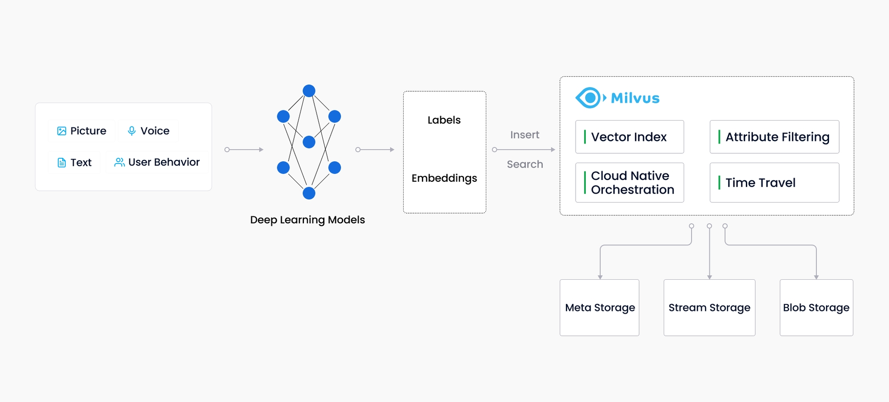

+++
title = 'AI基建-向量数据库Milvus'
summary = '本文介绍在AI场景下的基础设施:向量数据库 以及 当前该领域下比较典型的开源产品 Milvus'
date = 2024-05-22T15:17:45+08:00
tags = ["aligorithm","AI"] 
categories = ["development"] 
+++

&emsp;&emsp;AI热潮之下，对各行各业的影响是深刻且不可阻挡的。   
&emsp;&emsp;自己作为一个开发者，关注点更多是在AI浪潮之下，对于技术发展的影响有哪些。加之，自己之前还在阿里的时候，最后一个项目正好是基于计算机视觉（CV）的AI线下空间智能解决方案，当时面临的一个实际问题，当各个摄像头通过端侧模型将视频逐帧Embbding 向量后，如何快速的搜索到相关联的图片。   
&emsp;&emsp;「举个例子： 当你走入某个商场，入口的摄像头拍摄了你的照片（假定为A.jpg），然后，你逛了商场的各个店铺。 有可能商场内部布置了上百了摄像头,每个摄像头都拍着了你当时的照片(n.jpg)，而摄像头与摄像头之间的图片是没有关联的。 此时，你就需要把所有的图片关联到一起去。 这个场景下，其实就需要使用到向量检索的能力。」
  
&emsp;&emsp;当时行业上还没有比较成熟的向量检索解决方案，只有Facebook开源了[faiss](https://github.com/facebookresearch/faiss) 这么一个向量库出来。    

&emsp;&emsp;  而在阿里内部，项目的基础是基于JAVA技术体系去搭建的。这就面临着一个适配性的问题。 经过各种考虑和权衡后，最终还是自己内部实现了一个基于JAVA技术栈的向量检索框架，来完成当时的业务述求，那时候的实现方案是基于CPU的方案，由于内存比较便宜，我们就用空间换时间，利用大内存机器来加载向量进行内存对比。虽然最终达到了当时业务的要求与效果，但实际上来说，那个方案是有很多的局限性的，比如横向扩展问题、计算效率偏低以及机器利用率水位有热点等等；  
&emsp;&emsp;当时，我们就在考虑，是否有一款产品能天然支持向量检索的同时，可以快速解决分布式相关的一些问题；在之后的时间里，由于自己离开项目组，然后又耽搁了一两年时间，也就没有再关注相关信息。直到最近这一年多，AI重新回到了大众的视野里面，而向量数据库也发展得越来越好，于是，又重新开始了解与学习。Milvus这个数据库，当时在阿里的时候，记得还是最开始起步，在我们项目进行过程中，其实对他有过调研，但是在那个时刻，它有不少的问题亟待解决，比如 需要自己来部署集群，没有快速指南，暂未有比较有说服力的产品在生产环境验证，包括最重要的是，当时没有Java语言的SDK使用 等等。也就暂时搁置  
&emsp;&emsp;而最近又重新关注起来，上述的那些问题也都一一逐个解决了。于是花了一点时间，重新系统的关注了下它的各个方面，也就有个这个文章； 

## Milvus能做什么
&emsp;&emsp;首先 它 是一个「向量」数据库; 主要针对的是非结构化数据。  
&emsp;&emsp;在计算机中会以「向量」的形式来进行描述。 比如一个 256维度的向量，实际使用的是数据中语言当中的 256维度的数组；而向量的产生都是由模型计算后，得到的产出物；  
&emsp;&emsp;「以我之前的项目经历来举例，会在摄像头中嵌入本地视觉模型，通过将图片一帧帧解码后，得到向量数据，最终这些向量数据会传入到云端，然后针对数据进行一系列的检索与配置」
所以，向量数据库一般都是针对AI系统来进行的，在我看来，是AI时代下的基础设施；
而这里多次提到的「向量」实际上是下面几点的具体措施描述
* 一个将非结构化数据转换成向量的能力描述；
* 向量数据是一个多维度的浮点型或者二进制数据；
* 通常用算法模型的方式来将非结构化数据转成向量；

&emsp;&emsp; 转换成向量数据后，这些不同的向量可以实现「以图搜图」的功效，比如，你想查一个人在商场里面哪些地方出现过，但是你只有一张图片，此时，系统需要你输入的就不再是传统软件类似的「文本信息」，而是一张图片。 而这个搜索背后要做的事情是
- 将输入的图片转换成向量，这个过程也叫「Embedding」
- 将这个向量与商场里面所有的图片向量进行「搜索」，得到最接近的个向量数据，一般是搜索「TopK」的数据
- 最后返回给你这些向量所对应的图片，展示给你确认

&emsp;&emsp;而这个搜索过程，一般是查找输入向量 的相似性 向量有哪些，常用的相似性搜索算法是 「ANN」(Approximate nearest neighbor)算法
这里借用一张Milvus官方的图来说明其在整个过程的作用与位置;

## Milvus的架构分析
&emsp;&emsp;了解完产品形态后，更关注的是，这个向量数据库的相应架构以及架构背后对应的原则有哪些?
&emsp;&emsp;在看完他们的官方文档后，对我来讲印象最深刻的原则和要点主要有几点，简要的归纳与总结一下 

- 首先，它是一个在设计原则上天然的云原生设计，一开始就以「云」为基座来进行设计架构的，所以后续它的发展可以在全球主要的云计算厂商中快速搭建起来
- 其实，它也遵循了最近几年中数据库产品的流行架构倾向，既「存算分离」，存储与计算节点分开，存储可以用共享存储，也可以用分布式存储，而计算资源或者节点做成无状态设计，这样有利于横向的扩展，有利于解决面对流量不确定性下的 伸缩与资源利用率与成本之间的平衡问题
- 最后，它在内部设计中，将多变的部分做了比较好的抽象隔离，比如，将数据模型分为「collections」以及「segments」，有利于后续的数据恢复以及数据同步，而后，在最终存储介质之上搭建抽象模型，实际物理介质上可以选用各种类型的数据库，比如KV存储、对象存储以及LogBroker等其他多模态的存储介质;

  在分布式系统工程设计上，他们有四个抽象模型：访问层、协调服务、存储服务以及日志服务； 
- 对于数据的同步以及负载均衡等调度类或者控制类的核心职责，其会让「协调服务」这个核心服务参与分发。
- 对于对外访问、检验等等服务处理，交给访问层或者叫「Proxy」来统一处理
- 工作节点是无状态节点，其接受对应的指令，进行计算任务「这类任务往往朝生夕死」所以其是无状态节点，可以快速横向进行扩容；
- 最底层的是数据库的存储层，除了做数据存储之外，这个组件当中还有「外交」职责
  - 类似的数据库产品一般都需要与外部生态系统进行打通，这个核心职责，Milvus的架构设计中有单独的角色「LogStore」
  - 典型的场景是，当数据发生变更后，需要及时通知到上下文相关的生态系统，利用Pub-Sub的架构原则来构造这个角色，非常适合类似的场景

  其他，有一个令我印象比较深的问题「分布式场景下，一个搜索下去，是怎么查询到向量相似性 TOP(10)类似的结果的,是每个机器搜索，拿到结果再统一合并，还是逐个逐个机器排列搜索？ 针对这个问题，我在他们的文档中找到相应的设计分享，总结如下」
- 这种场景，通常会由访问层服务「比如Proxy」直接下发指令给「Query节点」 ，在每路Query节点内部进行相似性查找后，再统一在Proxy节点中将每一路的Query结果进行组合归并后进行处理返回。
- 而多路归并的整体流程，简要总结一下它的做法
  * 每一路搜索topk个命中结果，在这一路结果内部，会按照某个值排列，比如「score降序，score 越大，表示命中结果与待查向量越相似」, 而不同搜索结果之间命中结果互相独立。
  * Proxy 如何对结果进行归并也只关注一个搜索结果如何归并即可
  * 于是问题退化为，假定有4个Query节点的结果,每个搜索都是找top(10)。「4个长度为 topk(10) 的数组，每个数组降序排列，如何从这 4个数组中得到其中最大的10(topk) 个数」
  * 最终，既使用 多路归并 算法来完成这多个搜索结果的合并，核心点在于
    * 该算法脱胎于归并排序算法的归并阶段，两者**共同点**是归并时结果已经排序，
    * **不同点**是**归并排序是归并两路结果**，**reduce 这里归并多路结果**
    * **对比归并排序时使用两个指针记录两路结果的偏移量，proxy reduce 使用多个指针 locs 记录多路结果的偏移量。**
  - [相关的设计文档](https://github.com/milvus-io/milvus/blob/f3f46d3bb2dcae2de0bdb7bc0f7b20a72efceaab/docs/developer_guides/proxy-reduce-cn.md)

## 小结
&emsp;&emsp;关于Milvus的其他知识点，还有很多的内容需要去了解。 包括，其实业内一直把其作为向量数据库来使用，但是在Milvus的2.0版本中，其也支持了纯量数据的精确查询，我记得在某一档播客结果中，他们的创始人提到了，可以使用Milvus直接替换掉类似ES等产品，直接实现非常精确的查询能力。  

&emsp;&emsp;也包括，像其作为一个分布式数据库产品，对于分布式一致性的处理也是非常完善的，其允许用户配置一致性等级，完整的在效率以及数据准确性上做出场景下的选择；  

&emsp;&emsp;总之，这个产品还有非常的内容值得仔细研究与学习，这里只是一个简要的分享，更多的内容可以在他们的官网上查询到。另外，源代码也是开源的，有时间的情况下，需要好好的读一下对应的代码，了解下其中的细节；

## 附录
- [Milvus架构](https://milvus.io/docs/architecture_overview.md)
