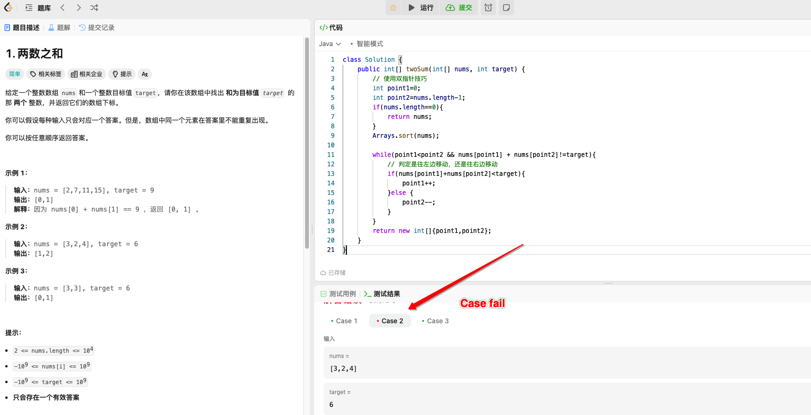

+++
title = '算法题记: 双数之和'
date = 2024-04-07T16:42:43+08:00
tags = ["skill","aligorithm"]
categories = ["development"] 
draft=true
+++

原题地址: [两数之和-非排序数组](https://leetcode.cn/problems/two-sum/description/)  

## 解题过程

第一思考是利用双指针来进行解答，写了第一遍结果，跑测试用例的时候发现失败。 再仔细看题目，发现有一个前提条件不成立。
又尝试仔细观察了一下原题里面的条件。
发现其中**并没有说明数组是按照顺序进行过相应排序的**，也就意味着，我们在指针移动之时，很难确定是往左还是往右移动.

于是，只能看一下题解,其思路是使用一个哈希表来进行寻址。
其中值得注意的点是，寻址的思路是将 目标target 与 当前遍历的值进行 差值比较， 若哈希表已有 当前差值 ，则表示哈希表里面有两个可以完全匹配 target的对象，接下来就是返回对应的哈希坐标即可
```
if (numbers == null) {
    return null;
}
Map<Integer, Integer> maps = new HashMap<>();
for (int i = 0; i < numbers.length; i++) {
    // 若map里面有差值,则说明有其他数字 与 当前数 之和 为 target. 也就是有了目标数
    if (maps.containsKey(target - numbers[i])) {
        return new int[]{maps.get(target - numbers[i]), i};
    }
    maps.put(numbers[i], i);
}
return null;

```

而相关联的 [有序数组两数之和](https://leetcode.cn/problems/two-sum-ii-input-array-is-sorted/description/)，则可以完全使用开始的双指针技巧
```
if (numbers == null) {
    return null;
}
int one = 0, two = numbers.length - 1;
while (one < two) {
    int sum = numbers[one] + numbers[two];
    if (sum == target) {
        return new int[]{one + 1, two + 1};
    } else if (sum < target) {
        one++;
    } else {
        two--;
    }
}
return null;
```

## 思考总结
- 做了多年的工程实践，对于算法题目，思路的欠缺是比较致命的
- 这种思路的欠缺一方面要通过大量练习来弥补，一方面要有举一反三的能力
- 算法题并不是很高深的技术，它与任何计算机技术一样，持续的练习，刷题会带来质量的变化
- 多年工作经验的人典型的心态转变要处理好，一开始是不屑做题，然后是做题过程中的挫败，接下来才是拉开差距的点
  - 要么奋起刷题，百炼成钢，调整好心态，接受挫败，逐步的化解，牢记以及消化它们
  - 要么鄙视其，彻底丢弃它，无视它，那么多年后，依然还是无法理解这些算法题

 在心态处理方面，我更倾向于上述心态的前者，前者是直面问题，成长性思维的体现，有时候转换思路，我们何不把算法题作为大脑的健身操，而不是把它仅仅作为面试找工作的八股文来看待呢？ 
